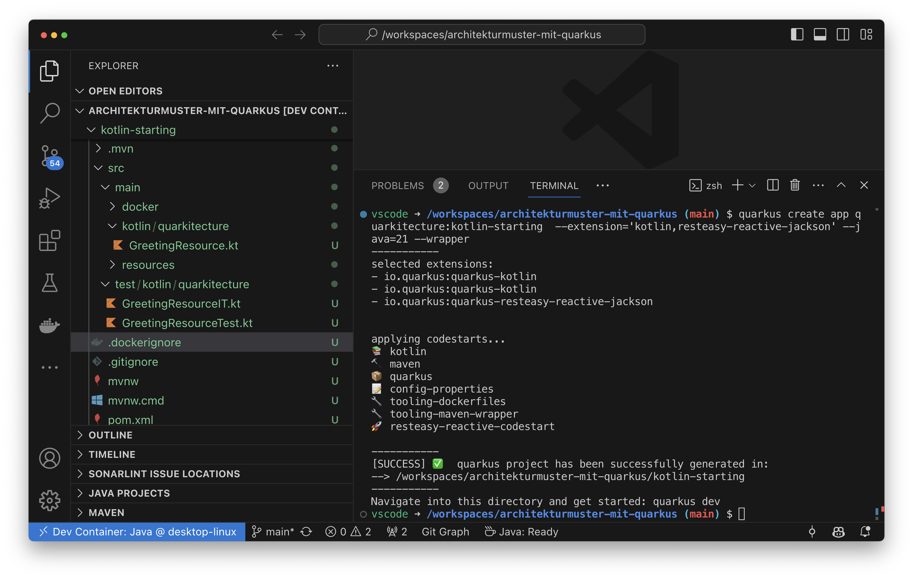

# kotlin-starting

Dieses Projekt zeigt, wie mit Kotlin ein Quarkus Backend erstellt werden kann.

Wir folgen dabei der Anleitung unter https://quarkus.io/guides/kotlin .

## Anlegen eines neuen Kotlin-Projekts

```bash
quarkus create app quarkitecture:kotlin-starting  --extension='kotlin,resteasy-reactive-jackson'--java=21 --wrapper
```



## Was muss installiert werden?

### Devcontainer

Für die Kommandozeile muss im Devcontainer nichts ergänzt werden:
-  Der Kotlin Compiler wird als maven dependency eingebunden.

Damit VS Code die Kotlin-Dateien korrekt anzeigt, muss das Kotlin-Plugin installiert werden.

- in der .devcontainer.json ergänzt man die Extension:
  ```json
   "customizations": {
          "vscode": {
              "extensions": [
                  // [...]
                  "fwcd.kotlin"
              ],
  ```

Das Projekt kann wie gewohnt gebaut und gestartet werden:

- im interaktiven Quarkus-dev Modus mit `quarkus:dev`bzw. `./mvnw quarkus:dev`

Oder man läßt nur bauen,
entweder mit den maven lifecycle commands wie
 - `./mvnw clean package`
 - `./mvnw test`

oder mit dem Quarkus-eigenen goal:
 - `./mvnw quarkus:build`
