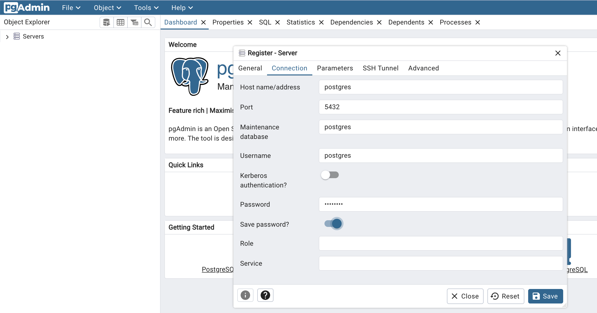

# liquibase

## Quarkus Projekt

Dieses Projekt benutzt diese extensions:

````bash
quarkus extension list
# 2024-09-02 09:02:36,042 WARN  [io.qua.boo.res.mav.wor.WorkspaceLoader] (ForkJoinPool.commonPool-worker-3) Module(s) under /workspaces/architekturmuster-mit-quarkus/getting-started will be handled as thirdparty dependencies because /workspaces/architekturmuster-mit-quarkus/getting-started/pom.xml does not exist
# Looking for the newly published extensions in registry.quarkus.io
# Current Quarkus extensions installed:
#
# ✬ ArtifactId                                         Extension Name
# ✬ quarkus-hibernate-orm-panache                      Hibernate ORM with Panache
# ✬ quarkus-jdbc-h2                                    JDBC Driver - H2
# ✬ quarkus-jdbc-postgresql                            JDBC Driver - PostgreSQL
# ✬ quarkus-liquibase                                  Liquibase
# ✬ quarkus-resteasy-reactive-jackson                  RESTEasy Reactive Jackson
#
# To get more information, append `--full` to your command line.
````
- h2 für schnelle in-memory datenbank Tests mit JPA
- postgres für eine containerisierte Datenbank im dev Modus

### Starten der Container-Datenbank postgresql

````bash
# starten
docker compose up -d postgres
# stoppen
docker compose down

````

## Das maven plugin für liquibase

grundlegende Konfiguration muss unter `<build><plugins></plugins>` so angelegt werden:

````xml
<build>
    <plugins>
        <plugin>
            <groupId>org.liquibase</groupId>
            <artifactId>liquibase-maven-plugin</artifactId>
            <version>4.29.1</version>
            <configuration>
            </configuration>
        </plugin>
````
Die Konfiguration des liquibase plugin im Abschnitt `<configuration>`:

````xml
    <configuration>

        <searchPath>${project.basedir}/src/main/resources/db</searchPath>
        <changeLogFile>changeLog.xml</changeLogFile>
        <outputChangeLogFile>${project.basedir}/target/generated-changelog.xml</outputChangeLogFile>
        <url>jdbc:postgresql://${env.DB_HOST}:5432/katalog</url>
        <username>postgres</username>
        <password>password</password>
</configuration>
````
- die Umgebungsvariable DB_HOST wird in der vscode Konfiguration gesetzt und berücksichtigt, ob die postgres Datenbank unter localhost oder per docker network unter ihrem hostname `postgres` zu erreichen ist.

## Arbeiten mit liquibase zur Schemagenerierung

Idee:
1. eine vormals generierte
````bash
mvn liquibase:generateChangeLog
````

- schreibt in die Datei`generated-changelog.xml`
  - der Name ist in der pom.xml konfiguriert unter
     `<outputChangeLogFile>generated-changelog.xml</outputChangeLogFile>`

````bash
# zum löschen der Datenbank einfach Container löschen mit: down
docker compose down
# dadurch wird hier eine neue Instanz erzeugt: up
docker compose up -d postgres
# die zwei Schemata
mvn test -Dquarkus.test.profile=referenz
mvn test -Dquarkus.test.profile=prod
mvn liquibase:diff
mvn test -Dquarkus.test.profile=prod
mvn liquibase:diff
mvn liquibase:generateChangeLog
rm target/generated-changelog.xml
mvn liquibase:generateChangeLog
diff src/main/resources/db/changeLog.xml target/generated-changelog.xml
````
## psql Befehle auf Kommandozeile

Um in die Datenbank hineinzuschauen, muss gegeben sein:

1. die Datenbank läuft
2. der `psql` Befehl kann von der Kommandozeile aus gestartet werden
3. Ausgaben erscheinen auf der Kommandozeile

Starte `psql` im Container mit dem `exec` Befehl von `docker`:

````bash
docker compose exec postgres bash
# root@a011eca056c9:/#
````
Danach kann mit dem Befehl `psql` eine interaktive SQL-Befehlszeile gestartet werden. Das neue prompt erlaubt nun SQL direkt an die Datenbank zu schicken:

- Parameter `-U`: der username
- Parameter `-d`: der Datenbankname


Postgres gruppiert Tabellen in Schemata, und Schemata finden sich in Datenbanken, In einem Schema liegen dann die SQL Tabellen.

- Der user `postgres` ist der sogenannte root und deshalb umfassend berechtigt, auf alle Schemata und Datenbanken zuzugreifen,
- definiert wurde er [hier](docker-compose.yml):

    ````bash
    # docker-compose.yml
    services:
    postgres:
        environment:
        POSTGRES_USER: postgres
        POSTGRES_PASSWORD: password
        POSTGRES_DB: "katalog"
    ````

    ````bash
    # application.properties:
    quarkus.datasource.jdbc.url=jdbc:postgresql://${DB_HOST:localhost}:5432/katalog
    # der Datenbankname lautet: katalog
    ````

Mit diesen Informationen starten wir die SQL-Befehlszeile:


````bash
root@a011eca056c9:/# psql -U postgres -d katalog
# psql (14.1 (Debian 14.1-1.pgdg110+1))
# Type "help" for help.

katalog=# SELECT tablename FROM pg_tables WHERE schemaname = 'public';
#        tablename
# -----------------------
#  databasechangeloglock
#  databasechangelog
#  hibernate_sequences
#  katalogentity
# (4 rows)
postgres=# SELECT
  n.nspname AS schema_name,
  pg_catalog.PG_GET_USERBYID(n.nspowner) AS schema_owner
FROM pg_catalog.pg_namespace n
WHERE n.nspname NOT IN ('pg_catalog', 'information_schema')
ORDER BY schema_name;
#  schema_name | schema_owner
# -------------+--------------
#  pg_toast    | postgres
#  public      | postgres
# (2 rows)
 ````

 Weitere Befehle finden sich z.B. hier:

 - https://www.devart.com/dbforge/postgresql/studio/postgres-list-schemas.html#what-is-schema
 - ****

## Arbeiten mit GUI Admin-Wekzeug 'pgadmin'

So zeigt pgadmin die Struktur der Datenbank:


- starte den Container mit
    ````bash
    docker compose up -d pgadmin
    ````

- öffne im Browser unter http://localhost:9008/browser/
- Logindaten kommn von [hier](docker-compose.yml):

    ````bash
    pgadmin:
        image: dpage/pgadmin4
        environment:
        PGADMIN_DEFAULT_EMAIL: admin@admin.com
        PGADMIN_DEFAULT_PASSWORD: root
    ````
- klick auf das Icon mit dem Titel `Add New Server`:
  -  General
     -  Name: z.b. `local`
  -  Connection (müssen übereinstimmen mit denem im [docker-compose.yml](docker-compose.yml)):
     -   Host name/adress: `postgres` (wenn im Devcontainer arbeitend)
     -   Username: `postgres`
     -   Password: `password`
  -  

# H2 im Test
Im Projekt ist eine H2 als Test-Datenbank eingerichtet. Sie wird benutzt, wenn unit tests in der IDE oder mit `mvn test`ausgeführt werden.

- in der `application.properties` finden sich diese EInträge dazu:

Gleichzeitig ist eine postgres Datenbank mit ihrem Treiber hinterlegt für den Einsatz in den Profilen `dev` oder  `prod`
- https://quarkus.io/guides/hibernate-orm#setting-up-multiple-persistence-units

### troubleshooting

- java.lang.IllegalStateException: The named datasource 'default-reactive' has not been properly configured. See https://quarkus.io/guides/datasource#multiple-datasources for information on how to do that.
- `[error]: Build step io.quarkus.hibernate.orm.deployment.HibernateOrmProcessor#configurationDescriptorBuilding threw an exception: io.quarkus.runtime.configuration.ConfigurationException: Datasource must be defined for persistence unit 'h2test'. Refer to https://quarkus.io/guides/datasource for guidance.`
   - `quarkus.hibernate-orm."pg".datasource=pg`
   - Lösung: sobald mehr als eine persistenceunit benutzt wird, muss diese konfigurativ eindeutig mit einer definierten datasource verbunden werden!
 - `[error]: Build step io.quarkus.hibernate.orm.deployment.HibernateOrmProcessor#configurationDescriptorBuilding threw an exception: io.quarkus.runtime.configuration.ConfigurationException: Packages must be configured for persistence unit 'guitars'.`
   - ....
 - `[ERROR] liquibase.exception.LiquibaseException: liquibase.exception.CommandValidationException: Output ChangeLogFile '/workspaces/architekturmuster-mit-quarkus/liquibase/target/generated-changelog.xml' already exists!`
   - einfach die Datei vorher löschen, denn das Kommando `mvn liquibase:generateChangeLog` vermeidet das stille Überschreiben der in er pom.xml deklarierten Ausgabedatei.


## Links

- Offizielles Docker image für postgres:
  - https://hub.docker.com/_/postgres/
  - darin beschrieben, wie man mit einem [init script](./src/test/docker/postgres/init-postgres.sh) eine zweite Datenbank erzeugt.