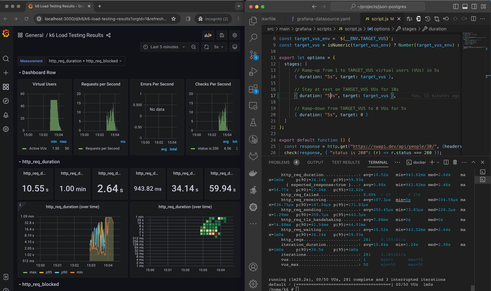

# Load testing mit K6

## Starten der Umgebung mit docker compose

```bash
docker compose -f docker-compose-k6.yml up -d
```

## k6 auf Kommandozeile benutzen

k6 ist ein Kommandozeilentool.

k6 kann auf dem eigenen Rechner installiert werden oder im Docker Container `k6` der mit dem compose gestartet wurde.

Im Container `k6` kann eine Kommandozeile geöffnet werden durch `exec`, aufgerufen im VSCode-Terminal:


```bash
docker compose -f docker-compose-k6.yml exec k6 /bin/ash
# /home/k6 #
```

Es benötigt zwei Parameter:

1. das Test-Skript
1. die URL der influxdb-Zeitreihendatenbank

   - das Ausgabeziel ist als Umgebungsvariable K6_OUT hinterlegt:
        ```bash
        export K6_OUT=influxdb=http://influxdb:8086/k6
        k6 run /scripts/script.js
        ```

   - oder mit Kommandozeilenparameter `--out`:

        ```bash
        k6 run /scripts/script.js --out influxdb=http://influxdb:8086/k6
        ```

## Starten im VS Code - Devcontainer

Das Projekt sollte im Dev Container ("reopen in devcontainer") gestartet werden, damit alle tools verfügbar sind.

Vor dem Testlauf ist das quarkus Projekt mit `quarkus dev` zu starten, so dass es auf der URL, so wie im script angegeben, erreichbar ist:

- die script.js Datei wird im k6 Container gemountet und enthält die zu testende URL:

    ```bash
    export default function () {
    const response = http.get("http://host.docker.internal:8080/organizations?_pagesize=100&beschreibung=GetPaginated", {headers: {Accepts: "application/json"}});
    check(response, { "status is 200": (r) => r.status === 200 });
    sleep(.300);
    };
    ```

   - `host.docker.interal` ist der hostname, so wie das Gastsystem aus einem Devcontainer aus erreicht werden kann


### Starten des k6 Tests

Mit der Ausführung erscheint diese Meldung und der Test startet.

Am Ende wird eine Statistik ausgegeben:
```bash

# /home/k6 # k6 run /scripts/script.js
#
#           /\      |‾‾| /‾‾/   /‾‾/
#      /\  /  \     |  |/  /   /  /
#     /  \/    \    |     (   /   ‾‾\
#    /          \   |  |\  \ |  (‾)  |
#   / __________ \  |__| \__\ \_____/ .io
#
#   execution: local
#      script: /scripts/script.js
#      output: InfluxDBv1 (http://influxdb:8086)
#
#   scenarios: (100.00%) 1 scenario, 500 max VUs, 1m50s max duration (incl. graceful stop):
#            * default: Up to 500 looping VUs for 1m20s over 5 stages (gracefulRampDown: 30s, gracefulStop: 30s)
#
#      ✓ status is 200
#
#      checks.........................: 100.00% ✓ 9472      ✗ 0
#      data_received..................: 816 kB  4.2 kB/s
#      data_sent......................: 1.7 MB  8.8 kB/s
#      http_req_blocked...............: avg=317.4µs  min=625ns    med=3µs      max=245.03ms p(90)=8.12µs  p(95)=18.75µs
#      http_req_connecting............: avg=229.64µs min=0s       med=0s       max=244.96ms p(90)=0s      p(95)=0s
#      http_req_duration..............: avg=601.73ms min=1.86ms   med=9.68ms   max=2m10s    p(90)=1.23s   p(95)=3.68s
#        { expected_response:true }...: avg=588.05ms min=1.86ms   med=9.68ms   max=46.26s   p(90)=1.23s   p(95)=3.68s
#      http_req_failed................: 0.01%   ✓ 1         ✗ 9479
#      http_req_receiving.............: avg=5.76ms   min=0s       med=44.72µs  max=9.11s    p(90)=161.8µs p(95)=492.29µs
#      http_req_sending...............: avg=642.2µs  min=2.7µs    med=13.2µs   max=602.33ms p(90)=48.42µs p(95)=101.04µs
#      http_req_tls_handshaking.......: avg=0s       min=0s       med=0s       max=0s       p(90)=0s      p(95)=0s
#      http_req_waiting...............: avg=595.33ms min=1.83ms   med=9.59ms   max=2m10s    p(90)=1.22s   p(95)=3.68s
#      http_reqs......................: 9480    49.02627/s
#      iteration_duration.............: avg=872.63ms min=302.21ms med=310.52ms max=28.09s   p(90)=1.55s   p(95)=3.9s
#      iterations.....................: 9472    48.984898/s
#      vus............................: 0       min=0       max=500
#      vus_max........................: 500     min=500     max=500
#
#
# running (3m13.4s), 000/500 VUs, 9472 complete and 476 interrupted iterations
# default ✓ [======================================] 476/500 VUs  1m20s
# /home/k6 #

```

## Statistiken im Grafana Dashboard

Unter der URL [http://localhost:3000/d/k6/k6-load-testing-results?orgId=1&refresh=5s&from=now-15m&to=now]() erscheint das Dashboard mit Daten, nachdem der Test gelaufen ist.

